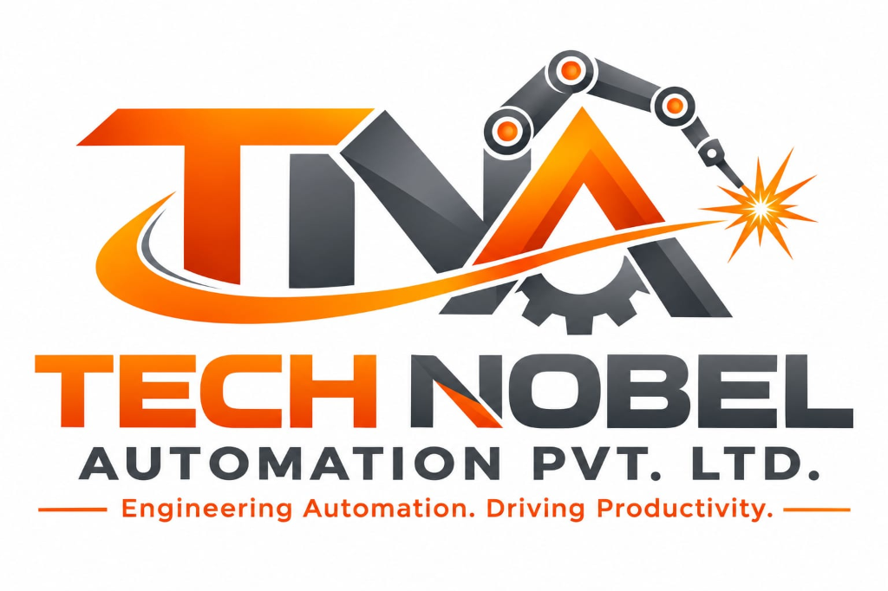

# Technobel Automation Pvt. Ltd. — Corporate Web Application & API Server



> **Empowering Industries with Intelligent Automation — Engineered for Results.**

Technobel Automation Pvt. Ltd. (based in Kuruli, Khed, Pune) is a premier full-stack industrial automation, robotics, and Special Purpose Machine (SPM) engineering company.

---

## 🌟 Key Features & Capabilities

- **Interactive 3D Robotic Canvas**: Built using `@react-three/fiber` & Three.js rendering articulated 3D robotic arms, industrial gear assemblies, and CAD model spec previews.
- **"Our Services" Breakdown Cards**: Nester Automation style capabilities layout with supported brand badges (Siemens, Allen-Bradley, Mitsubishi, Fanuc, ABB, Yaskawa, KUKA, Omron) and two-column capability lists.
- **Trusted Client Ecosystem**: Sleek SVG brand logo grid and continuous sliding marquee showcasing Kongsberg Automotive, Yaskawa, Bellsonica, SKH Group, Dikacto Robotics, JBM Group, Ultra Corpotech, JSW Motors, Patil Automation, Lean Automation, and KHK Gears.
- **Categorized 4-Column Video Gallery**: Industry-specific robotics video/photo gallery featuring Two-Wheeler welding lines, Four-Wheeler automotive cells, Railway component automation, and Heavy Fabrication SPMs.
- **Request for Quote (RFQ) System**: Interactive modal dialog and floating quick-contact dock supporting 2D/3D CAD (.STEP, .DWG) and PDF file uploads (up to 15MB).
- **Node.js Express Backend API**: Express server handling `/api/contact` and `/api/rfq` multipart form submissions with Multer file storage.

---

## 🛠️ Architecture & Tech Stack

### Frontend
- **Core Framework**: React.js (Vite Single Page Application)
- **Styling**: Tailwind CSS + Custom Glassmorphism & Industrial Metal Silver Palette (`#F4F6F9`, `#0052CC`, `#F59E0B`, `#1E293B`, `#DC2626`)
- **3D Engine**: Three.js, `@react-three/fiber`, `@react-three/drei`
- **Animations**: Framer Motion
- **Icons**: Lucide React & Custom SVG Brand Logos
- **Routing**: `react-router-dom`

### Backend
- **Server**: Node.js + Express.js
- **File Uploads**: Multer
- **Email Notifications**: Nodemailer
- **Middleware**: CORS, Body Parser, Static File Serving

---

## 🚀 Quick Start & Installation Guide

### Prerequisites
- Node.js (v18.x or higher)
- npm (v9.x or higher)

### 1. Clone the Repository
```bash
git clone https://github.com/Ombhaltilak712/technobel-automation.git
cd technobel-automation
```

### 2. Run Backend API Server
```bash
cd backend
npm install
npm start
# Server starts on http://localhost:8080
```

### 3. Run Frontend React Application
```bash
cd frontend
npm install
npm run dev
# Application starts on http://localhost:3000
```

---

## 📍 Factory & Head Office Location

- **Company**: Technobel Automation Pvt. Ltd.
- **Founder & Managing Director**: Sachin Ramdas Pacharne
- **Address**: Gat No. 285/4, At Post Kuruli, Behind Ice Age Cold Storage, Dongre Wasti, Tal. Khed, Dist. Pune – 410501, Maharashtra, India.
- **Phone**: +91 9185202138
- **Email**: Info.technobelautomation@gmail.com

---

## 📄 License

© 2026 Technobel Automation Pvt. Ltd. All rights reserved.
